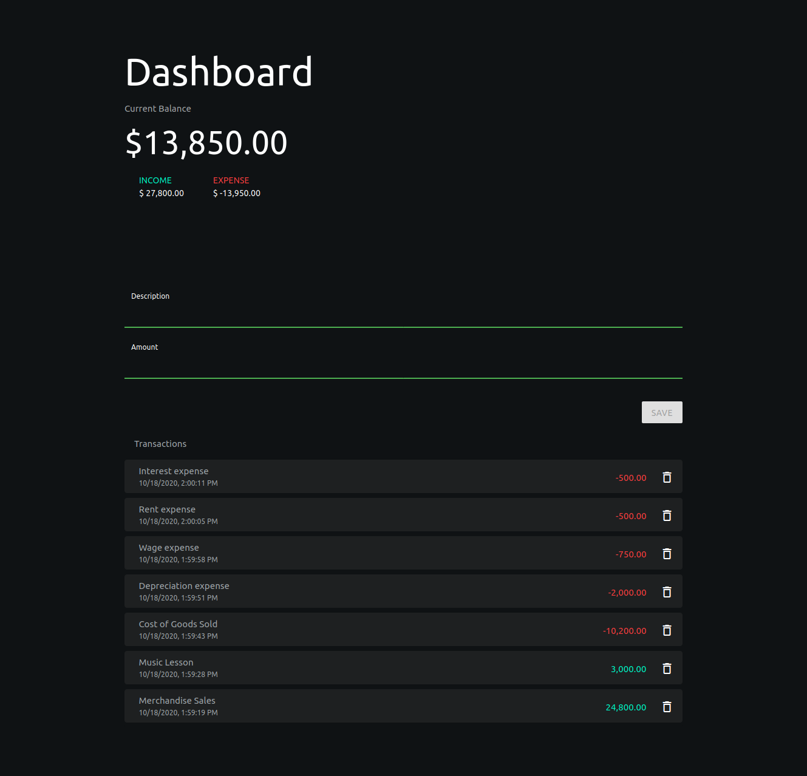

  
  <h1 align="center">Expenses</h1>

## Table of Contents

* [About The Project](#about-the-project)
  * [Built With](#built-with)
* [Demo](#demo)
* [License](#license)

## About The Project
💸 Keep track of your expenses

### Built With
* [Svelte](https://svelte.dev/)
* MongoDB
* Express
* NodeJS
* CSS

## Demo

[Demo](https://lp-expenses.herokuapp.com/)

## License
This project is open source and available under the [MIT License](LICENSE).